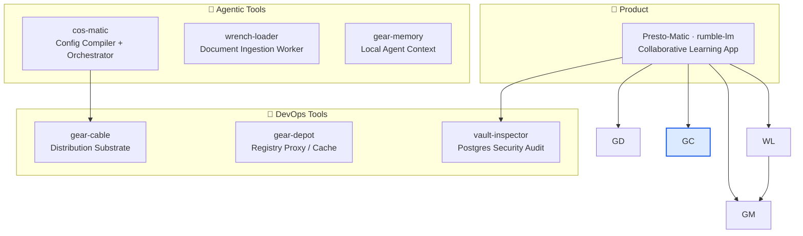

# gear-cable

> Rust-first distribution substrate for multi-platform developer tools — build matrices, artifact graphs, release manifests, checksums, signatures, provenance, and sovereign install floors.

[](LICENSE)
[](https://www.rust-lang.org)
[](https://github.com/constantin-jais/gear-cable/actions/workflows/ci.yml)

> **Status:** `v0` · WIP — core manifest/artifact model proven; install/update/doctor flows in progress.

## Why it exists

Distribution logic for developer tools tends to get reimplemented in each consumer: install scripts, update flows, artifact verification. `gear-cable` extracts that layer into a single Rust core, so cos-matic and other tools get forward-only releases, signed artifacts, and store-free install paths without duplicating the logic.

## Ecosystem



## Doctrine

- **Forward-only releases** — publish is append-only; recovery is `compensate`, not rollback.
- **Signed artifacts** — checksums, signatures, SBOM, and provenance are modeled as release gates.
- **Sovereign install floors** — every supported platform needs at least one store-free install path (iOS EU DMA caveat documented).
- **One Rust core** — generated bindings may expose the core, but distribution logic is not reimplemented in Swift/Kotlin/TypeScript.
- **Dry-run by default** — planning and doctor commands are safe; mutating publish/promote commands require explicit opt-in.

## Workspace

| Crate             | Role                                                               |
| ----------------- | ------------------------------------------------------------------ |
| `gear-cable-core` | Pure Rust core: manifests, platforms, artifact graph, policy gates |
| `gear-cable-dist` | Side-effect boundary for distribution channels                     |
| `gear-cable-cli`  | `gear-cable` command surface                                       |

## Quick start

```bash
cargo run -p gear-cable-cli -- doctor
cargo run -p gear-cable-cli -- plan --manifest examples/cos-matic/gear-cable.toml
cargo run -p gear-cable-cli -- plan --manifest examples/cos-matic/gear-cable.toml --format json
```

## Development

```bash
cargo fmt --all --check
RUSTFLAGS="-D warnings" cargo clippy --workspace --all-targets --all-features
cargo test --workspace --all-features
./scripts/audit-deps.sh
```

## Related projects

| Repo                                                                  | Role                                                       |
| --------------------------------------------------------------------- | ---------------------------------------------------------- |
| [cos-matic](https://github.com/constantin-jais/cos-matic)     | Primary consumer — distribution substrate for cosmatic releases |
| [Presto-Matic](https://github.com/constantin-jais/rumble-lm)          | Sovereign learning platform                                |
| [wrench-loader](https://github.com/constantin-jais/wrench-loader)         | Document ingestion worker                                  |
| [gear-memory](https://github.com/constantin-jais/gear-memory)         | Local agent context layer                                  |
| [gear-depot](https://github.com/constantin-jais/gear-depot)       | Sovereign registry proxy / cache                           |
| [vault-inspector](https://github.com/constantin-jais/vault-inspector) | Postgres security audit                                    |

## License

MIT © Constantin Jais
